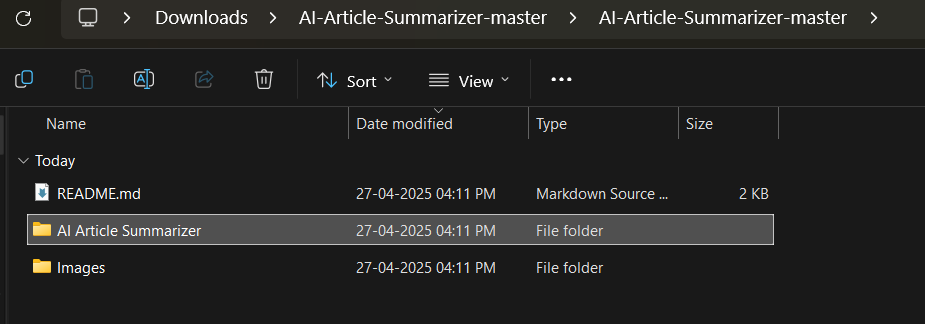
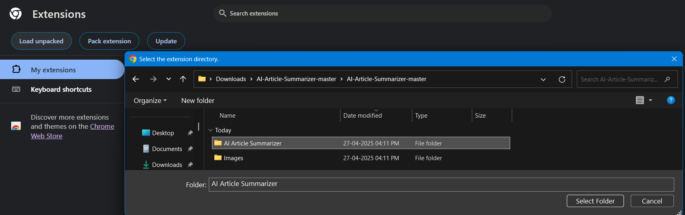
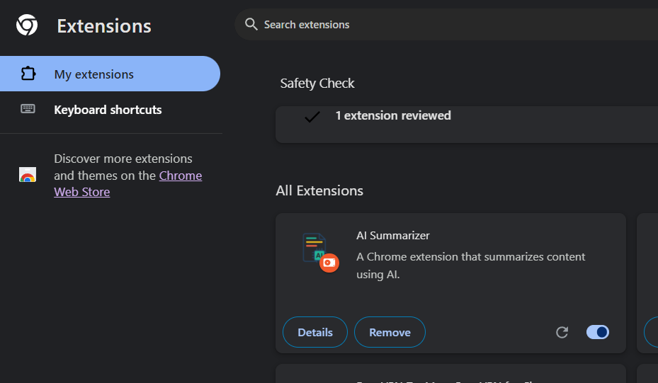

## 🚀 How to Install the AI Article Summarizer Extension

### 1. **Download the Extension**

[Download the ZIP file here](https://github.com/pritam19-d/AI-Article-Summarizer/archive/refs/heads/master.zip)

---

### 2. **Locate the Downloaded ZIP**

Go to your **Downloads** folder and find the file named  
**AI-Article-Summarizer-master.zip**.


---

### 3. **Extract the ZIP File**

Double-click the ZIP file to extract it. You will see a folder named  
**AI-Article-Summarizer-master**. Open this folder to access the extension files.

```plaintext
Downloads/
└── AI-Article-Summarizer-master.zip
  └── AI-Article-Summarizer-master/
    ├── AI Article Summarizer
    ├── ...
```
---

### 4. **Find the Extension Files**

Inside the extracted folder, you will find the extension files as shown below.



Copy the folder to your desired directory.

---

### 5. **Open Your Browser**

Click on the **Extensions** button in your browser.


---

### 6. **Manage Extensions**

Click on **Manage Extensions**.


---

### 7. **Load the Extension**

Click the **Load Unpacked** button.


---

### 8. **Select the Extension Folder**

Choose the folder where you extracted the extension files.



---

## 🎉 Done!

Your extension is now **successfully installed** in your browser!
<br />